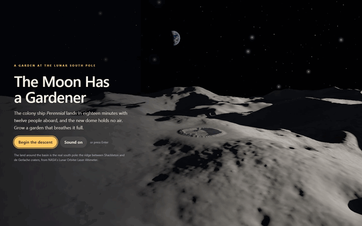
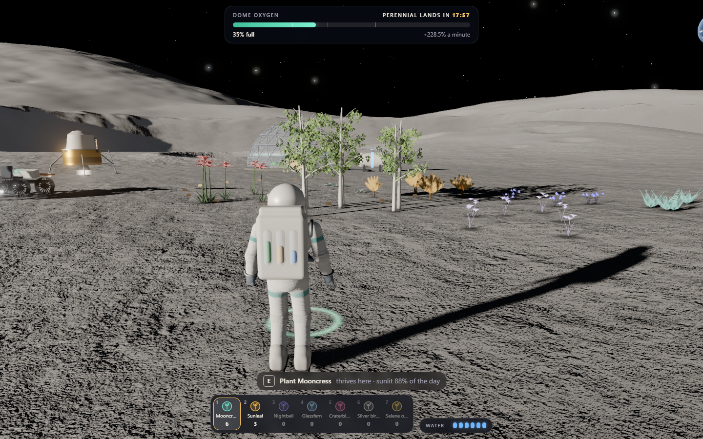
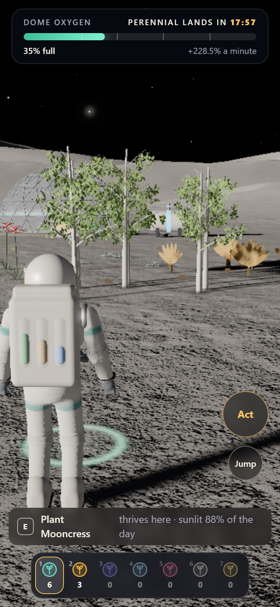

<p align="center"></p>

<p align="center">
  <a href="https://10-the-moon-has-a-gardener.williamking.workers.dev"></a>
  
  
  
  
  
</p>

**A free-roam garden at the real lunar south pole.** The colony ship *Perennial* lands in eighteen minutes with twelve people aboard, and the new dome holds no air. Lope across a crater basin in one-sixth gravity, plant seven alien species where the low Sun suits each one, water them from the ice, and let their blooms breathe the dome full. Then take off your helmet inside it: the first breath on the Moon.

<p align="center"></p>

## How to play

The Sun never climbs here: it circles the horizon once every eight minutes, about ten degrees up, so every hill and crater rim throws a long shadow that sweeps round with it. Each species wants its own share of the day in sunlight, and a ring on the ground shows, before you plant, how well a spot will suit the seed you hold (green: it will thrive). Plants grow while they are watered, and blooms breathe into the dome.

| Species | Wants | Where |
| --- | --- | --- |
| Mooncress | some sun | almost anywhere: the easy first crop |
| Sunleaf | full sun | open plains nothing shades |
| Nightbell | deep shade | crater shadow, behind shade panels |
| Glassfern | Earthlight | slopes facing Earth, not in full sun |
| Craterbloom | wet ground | by the ice in the bowl, or a sprinkler |
| Silver birch | sun and water | a sapling from the supply drop, by a sprinkler |
| Selene orchid | a gift | from the lanternfolk |

Oxygen milestones at 25%, 40%, 60% and 80% unlock the farm rover, the survey caches (follow the amber beacons), a supply drop of sprinklers and saplings, then suit jets. Fill it before the *Perennial* lands for gold; after, for silver or bronze.

| Input | Keyboard and mouse | Touch |
| --- | --- | --- |
| Walk, lope | `W A S D`, `Shift` | left half of the screen |
| Look, zoom | drag, wheel | right half |
| Plant, water, gather, open, drive | `E` | **Act** |
| Jump (hold with the jets) | `Space` | **Jump** |
| Choose a seed or tool | `1` – `9`, `Q` / `R` | tap the pouch |
| Mute (remembered) | `M` or Sound | Sound |
| Review controls | **Suit controls** | **Suit controls** |

## What's inside

- **The real south pole.** The land around the basin is NASA's Lunar Orbiter Laser Altimeter topography of the ridge between Shackleton and de Gerlache craters, out to 146 km, with the Moon's curvature. Every point's skyline is baked in sixteen directions on the GPU, so mountains throw true shadows for wherever the Sun stands, and once a day it sinks behind the hills to the west and the basin goes blue with Earthshine.
- **A cinematic arrival and ending.** A title shot high over the pole with Earth on the horizon, the lander's descent chased low over the craters, and at the end the *Perennial* landing, its colonists filing into the dome, and the helmet coming off.
- **A world alive without you.** Giant lanternfolk drift in procession along the crater rim and come down at dusk to hover over your blooms; rock-shelled grazers crop crystal lichen on the floor, planting their feet and finding paths around your plots; far off on a ridge something stacks glowing cairns, one stone each time you look away.
- **Growth you caused:** seven species with their own models and growth stages, shade panels that throw real shadows, sprinklers, a greenhouse dome whose air visibly rises, a drivable six-wheeled rover and suit jets.
- **Mission Control teaches by doing:** a persistent action guide that waits for real planting, watering, blooming and harvesting, replayable suit controls, and a prompt that says what `E` will do before you press it.
- **Lunar photometry:** a scanned regolith with Lommel-Seeliger shading and the opposition surge, a sun mask for the basin's long shadows, and Earth rendered live from NASA's Blue Marble with its phase following the Sun.
- **Built to run on a laptop:** three quality tiers and a frame governor that trades resolution for smoothness.

## Screenshots

| Desktop | Phone |
| --- | --- |
|  |  |

## Built with

Three.js for everything in the world, React for the suit's displays, TypeScript throughout, Vite and Bun for the build; the terrain bake in Python with NVIDIA Warp (CUDA).

- **Two depth layers:** the sky and the far land first, with a camera whose near plane starts where the main one ends, then everything close over fresh depth, so a boot a metre away and a mountain 100 km off both render cleanly.
- **Rules as pure, tested TypeScript** in `src/game/`: light shares traced over the same ground the renderer draws, growth, oxygen, milestones, what `E` does, the rover and the jets.
- **Real GPU tests:** scripted rounds, the ending and the README media run in headless Chrome through the game's test hooks.

## Run it locally

```sh
bun install --frozen-lockfile
bun run dev      # http://127.0.0.1:4520/
bun run check    # tsc, Biome, bun test, production build into dist/
bun run preview  # http://127.0.0.1:4620/
bun run test:e2e # against preview, real Chrome / D3D11; one worker
```

`src/engine/` holds the renderer, ground, far land, sky and camera; `src/game/` the rules; `src/scene/` the gardener, plants, base, rover, ships and life; `src/ui/` the HUD. `tools/bake/lola.py` rebuilds the lunar terrain from the NASA sources (see `docs/ASSET-SOURCING.md`), and `scripts/readme-media.mjs` records this page's media.

## Credits

- **Lunar topography:** NASA Goddard Space Flight Center, Planetary Geodesy Data Archive: LOLA 5 m/pix site DEMs and the 80 m/pix south polar mosaic (Barker et al.). Public domain. Relief is exaggerated 1.6× beyond the basin, as NASA's own visualisations of the pole often are.
- **Earth:** NASA Earth Observatory *Blue Marble: Next Generation*, NASA GSFC Blue Marble clouds and *Black Marble 2016*. Public domain; credit NASA Earth Observatory.
- **Regolith:** Poly Haven's `moon_dusted_05`, `moon_01` and `moon_meteor_01` scans, CC0.
- Use of NASA material does not imply NASA endorsement. Everything else (the suit, plants, base, rover, ships, life, sky) is authored in code. Type uses the system font stack.

Audio, all **CC0** (16 files, about 1.5 MB in `public/audio/`):

| File(s) | Use | Source | Author | Licence |
| --- | --- | --- | --- | --- |
| `music-observing-the-star.ogg` | music loop | https://opengameart.org/content/another-space-background-track | yd | CC0 |
| `ambience-deep-space-array.ogg` | ambience loop | https://opengameart.org/content/deep-space-array | Tozan | CC0 |
| `panel-place-1/2`, `step-1/2` | panel set down, footsteps | Impact Sounds, https://kenney.nl/assets/impact-sounds | Kenney (kenney.nl) | CC0 |
| `panel-lift`, `denied`, `cursor`, `ui`, `grow`, `hour`, `bloom`, `wilt` | interaction and day cues | Interface Sounds, https://kenney.nl/assets/interface-sounds | Kenney (kenney.nl) | CC0 |
| `garden-blooms`, `ending` | result and ending jingles | Music Jingles, https://kenney.nl/assets/music-jingles | Kenney (kenney.nl) | CC0 |

---

<p align="center"><sub>Part of William King's portfolio collection.</sub></p>
