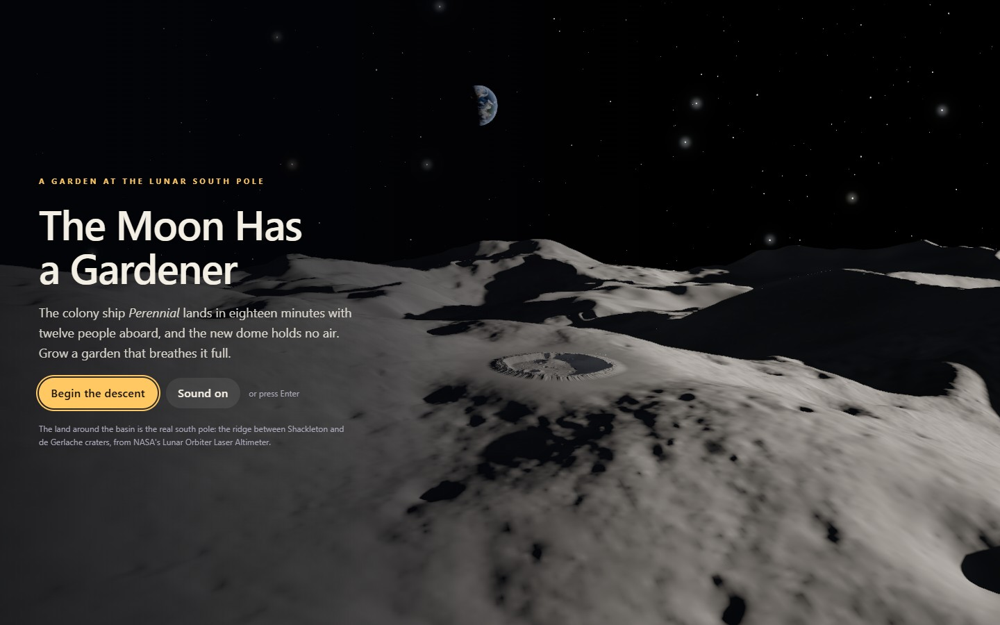
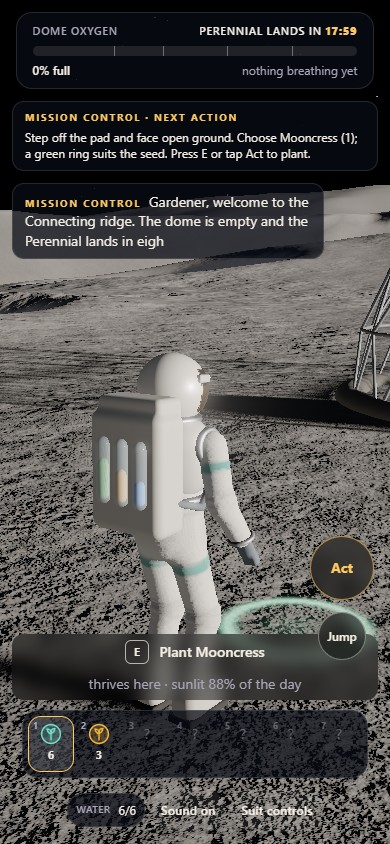
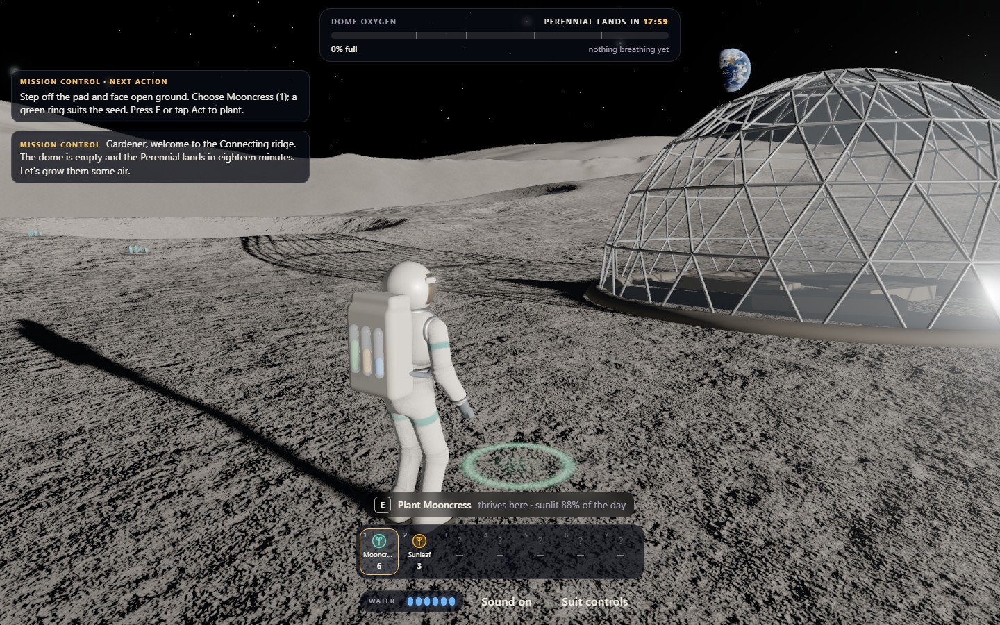
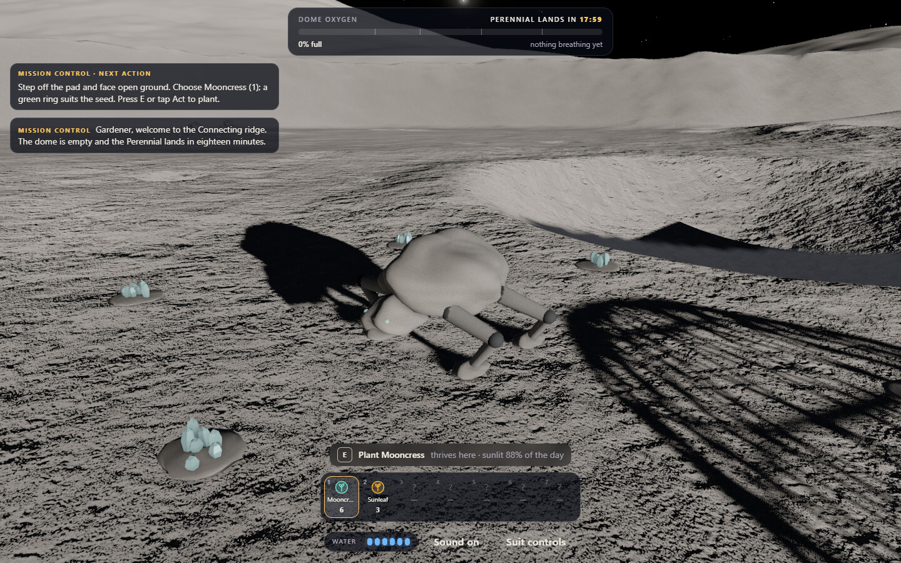

# THE MOON HAS A GARDENER

<p align="center"></p>

Grow the colony's first air at the lunar south pole. The Perennial is approaching with twelve people aboard, and the dome is empty. Plant an alien garden, find water and shade, unlock the rover and suit jets, then step inside and take off your helmet.

**[Begin the descent →](https://10-the-moon-has-a-gardener.williamking.workers.dev)** · [Run locally](#run-locally) · [Credits](#credits)

<p align="center"></p>

## From landing pad to living garden

The opening descends from the lunar horizon to the landing pad. Skip the film if you wish, review **Suit controls**, and follow Mission Control's action-led instructions: choose a seed, plant it, water it, watch it bloom and harvest. The guide waits for the corresponding action, and the prompt tells you what **Act** will do before you press it.

The low Sun circles the horizon during the simulated day, moving long terrain shadows. A placement ring estimates how well the selected species fits the spot. Growth needs water; mature plants generate the oxygen that fills the dome. Shade panels change exposure, sprinklers irrigate nearby crops, and solid obstacles cannot consume a seed or tool through an invalid placement.

| Species | Its role in the garden |
| --- | --- |
| Mooncress | A forgiving first crop for learning planting and watering. |
| Sunleaf | A crop for exposed, sunny ground. |
| Nightbell | A shade-loving plant for crater shadow or shade panels. |
| Glassfern | An Earthlight species with its own light requirements. |
| Craterbloom | A moisture-loving crop suited to reliable irrigation. |
| Silver birch | A slower sapling supplied as the garden progresses. |
| Selene orchid | A gift earned from the lanternfolk after your blooms attract them. |

At **25%, 40%, 60% and 80% oxygen**, unlock the rover, survey caches, supply drop and suit jets. Aim to fill the dome within eighteen simulated minutes for gold. Completing it brings the Perennial arrival, first breath and medal. **Keep gardening** returns you to the same garden, with the correct landed-ship status; the rare orchid remains something you can earn and grow afterward.

| Action | Keyboard / mouse | Touch |
| --- | --- | --- |
| Walk / lope | WASD / Shift | Left side of the screen |
| Look / zoom | Drag / wheel | Right side of the screen |
| Plant, water, collect, open or drive | E | Act, labelled with the current action |
| Jump / use unlocked jets | Space / hold Space | Jump / hold Jump |
| Select seed or tool | 1–9, Q/R | Pouch buttons |
| Review controls | Suit controls | Suit controls |
| Toggle sound | M or Sound | Sound |

Suit controls pause movement and the mission clock. Closing them restores focus for play. The ending supports continued gardening and a fresh replay through native keyboard-accessible controls.

## The Moon keeps its own company

**Rock grazers** plant their feet on the terrain, walk around your plots, pause to watch the gardener and crop crystal lichen. The low quality tier uses a smaller herd. **Lanternfolk** drift along the crater rim and visit blooms at dusk; a gift is placed on reachable, unoccupied ground. A distant **cairn builder** adds a glowing stone when you look away.

The wider landscape comes from NASA LOLA south-pole topography around Shackleton and de Gerlache. Baked directional skylines drive distant mountain shadows; the close basin, regolith, live Earth phase, ships and garden are drawn by direct Three.js. Separate near and far depth layers accommodate both nearby boots and distant ridges. Adaptive quality, shader preparation and finite-colour protection keep rendering bounded.

## Source and release evidence

[src/engine/](src/engine/) owns rendering and input; [src/game/](src/game/) owns gardening, light, oxygen and movement; [src/scene/](src/scene/) owns plants, creatures, ships and the ending; [src/ui/](src/ui/) owns the suit displays. [Asset-sourcing notes](docs/ASSET-SOURCING.md) describe the NASA terrain and imagery pipeline. CUDA is used offline for terrain preparation; the shipped browser game does not need Python or CUDA.

Application revision `51ec6f6` passed **95 tests / 743 assertions** and **11 RTX 2060 scenarios**. An independent CPU route walks the authored basin and earns the unlocks. A browser route uses real controls with test-assisted travel/time to cover all seven species, landing, continued play and replay. Separate tests cover grazer feet/routing, phone layouts, focus, slow assets and failure recovery. Matched 1280×720 GPU p95 measured **8.88 ms**, versus 10.06 ms before the pass. See the [full bug-pass report](docs/visual/BUG-PASS-2026-09-30.md) for the scope and limits.

## Current screenshots

| Desktop | Phone |
| --- | --- |
|  |  |





Grazer detail from the current release's GPU verification.

The opening loop and three main screenshots were captured from the live site on **1 October 2026**, using Chrome on this workstation; the phone image is a 390 × 844 browser viewport. The animated preview is a short loop, not a full playthrough. [Capture details](docs/readme/capture.json).

## Run locally

Use **Bun 1.3.10** (the version pinned in `package.json`) and Node.js 22.12 or newer. From this repository:

```sh
bun install --frozen-lockfile
bun run dev      # http://127.0.0.1:4520/
bun run check    # strict types, Biome, unit tests and production build
bun run preview  # http://127.0.0.1:4620/ after the build
```

Development and preview are separate long-running commands; run one at a time or use separate terminals. `bun run build` writes the static production output to `dist/`. Dependencies and the lockfile are local to this project.

### Browser suite

This project's suite uses installed **Google Chrome with D3D11 on Windows** and asserts a real NVIDIA/RTX renderer. It does not start its own server. After `bun run check`, keep `bun run preview` running in one terminal, then run this in a second terminal:

```sh
bun run test:e2e
```

The suite runs with one worker. Its test hooks distinguish earned progression from assisted travel/time and isolated failure fixtures; see the verification report above.

## Stack and release

Direct Three.js 0.186 · React 19.3 · strict TypeScript · Vite 8.3 · GSAP 3.15 · Tailwind CSS 4.3 · Bun 1.3.10 · Biome. The public website is served by Cloudflare Workers. This README describes [application revision 51ec6f6](https://github.com/WilliamHenryKing/10-the-moon-has-a-gardener/commit/51ec6f63efb607a0641f1bf3d2b507858f7f3ea4); the documentation refresh changes no application behaviour.

## Credits

- **Lunar topography:** NASA Goddard Space Flight Center, Planetary Geodesy Data Archive: LOLA 5 m/pix site DEMs and the 80 m/pix south polar mosaic (Barker et al.). Public domain. Relief is exaggerated 1.6× beyond the basin, as NASA's own visualisations of the pole often are.
- **Earth:** NASA Earth Observatory *Blue Marble: Next Generation*, NASA GSFC Blue Marble clouds and *Black Marble 2016*. Public domain; credit NASA Earth Observatory.
- **Regolith:** Poly Haven's `moon_dusted_05`, `moon_01` and `moon_meteor_01` scans, CC0.
- Use of NASA material does not imply NASA endorsement. Everything else (the suit, plants, base, rover, ships, life, sky) is authored in code. Type uses the system font stack.

Audio, all **CC0** (16 files, about 1.5 MB in `public/audio/`):

| File(s) | Use | Source | Author | Licence |
| --- | --- | --- | --- | --- |
| `music-observing-the-star.ogg` | music loop | [Source](https://opengameart.org/content/another-space-background-track) | yd | CC0 |
| `ambience-deep-space-array.ogg` | ambience loop | [Source](https://opengameart.org/content/deep-space-array) | Tozan | CC0 |
| `panel-place-1/2`, `step-1/2` | panel set down, footsteps | Impact Sounds, [Source](https://kenney.nl/assets/impact-sounds) | Kenney (kenney.nl) | CC0 |
| `panel-lift`, `denied`, `cursor`, `ui`, `grow`, `hour`, `bloom`, `wilt` | interaction and day cues | Interface Sounds, [Source](https://kenney.nl/assets/interface-sounds) | Kenney (kenney.nl) | CC0 |
| `garden-blooms`, `ending` | result and ending jingles | Music Jingles, [Source](https://kenney.nl/assets/music-jingles) | Kenney (kenney.nl) | CC0 |

---

Part of [William King's portfolio collection](https://github.com/WilliamHenryKing).
